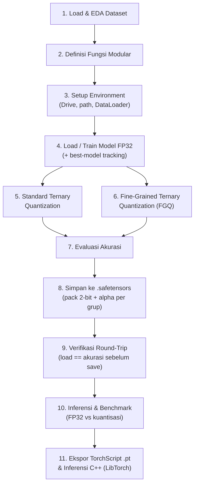

# Ternary Quantization on MNIST, Fashion-MNIST & CIFAR-10

Repositori ini berisi eksperimen **kuantisasi ternary** (bobot hanya bernilai $\{-\alpha, 0, +\alpha\}$, setara ~2-bit) pada beberapa arsitektur neural network — **MLP (Net)**, **LeNet-5**, dan **ResNet-18** — untuk tugas klasifikasi citra pada dataset **MNIST**, **Fashion-MNIST**, dan **CIFAR-10**.

> ### 🔷 Skema Penelitian: **Modular Pipeline**
>
> Penelitian ini menggunakan skema **Modular Pipeline**. Seluruh alur eksperimen — mulai dari *load & EDA dataset*, *training/evaluasi*, *kuantisasi*, *penyimpanan model*, hingga *inferensi & benchmark* — dipecah menjadi **blok fungsi modular yang independen dan dapat digunakan ulang**, lalu dirangkai sebagai **tahapan pipeline** yang berurutan.
>
> Skema ini merupakan hasil **refaktorisasi dari skema monolitik** (kode inline dan berulang dalam satu notebook besar) yang menjadi cikal bakal repositori ini. Notebook-notebook skema lama tetap disertakan sebagai pembanding pada folder `tes-1-Net/`, `tes-2-LeNet5/`, dan `tes-3-ResNet18/`.
>
> Implementasi acuan **Modular Pipeline** berada di folder [`Modular Pipeline/`](Modular%20Pipeline/readme.md).

---

## 📌 Ringkasan

| Aspek | Keterangan |
|---|---|
| **Skema penelitian** | **Modular Pipeline** (refaktorisasi dari skema monolitik) |
| **Task** | Klasifikasi citra 10 kelas |
| **Dataset** | MNIST, Fashion-MNIST, CIFAR-10 |
| **Arsitektur** | MLP (Net), LeNet-5, ResNet-18 (+ ResNet-18 Modified) |
| **Kuantisasi** | Standard Ternary & Fine-Grained Ternary Quantization (FGQ) — varian symmetric & asymmetric |
| **Output model** | `.pth` (checkpoint FP32), `.safetensors` (model ternary ter-*pack* 2-bit), `.pt` (TorchScript) |
| **Lingkungan** | Google Colab (Google Drive ter-mount) + LibTorch 2.4.0 (inferensi C++) |

---

## 🎯 Latar Belakang & Tujuan

Model deep learning umumnya disimpan dalam **FP32** (32-bit per bobot), sehingga mahal secara memori dan komputasi. **Ternary quantization** menekan representasi bobot menjadi 3 level nilai saja sehingga secara teoretis mendekati **~2-bit per bobot** tanpa mengorbankan akurasi secara signifikan.

Penelitian ini bertujuan untuk:

1. **Membandingkan** dua pendekatan kuantisasi ternary:
   - **Standard Ternary Quantization** — satu threshold dan satu skala per layer (*global*).
   - **Fine-Grained Ternary Quantization (FGQ)** — threshold dan skala per *group* kecil (N bobot).
2. **Menguji pengaruh group size (N)** terhadap akurasi.
3. **Menguji varian *asymmetric threshold*** — threshold & skala terpisah untuk nilai positif dan negatif.
4. **Memverifikasi** akurasi model hasil *save/load* agar identik (*round-trip consistency*).
5. **Mengukur** dampak kuantisasi terhadap kecepatan inferensi (latensi & FPS).

---

## 🗂️ Struktur Repositori

```
quantization-mnist/
├── README.md                                   # ← File ini (dokumentasi tingkat proyek)
├── Quantization_Model_with_MNIST_Dataset.ipynb # Notebook awal (skema monolitik, dataset custom dari Drive)
│
├── Modular Pipeline/                           # ⭐ SKEMA UTAMA PENELITIAN
│   ├── Quantization_MNIST.ipynb                # Modular pipeline — MNIST
│   ├── Quantization_Fashion_MNIST.ipynb        # Modular pipeline — Fashion-MNIST (+ TorchScript & C++)
│   └── readme.md                               # Detail skema modular
│
├── tes-1-Net/                                  # Eksperimen skema lama — MLP (Net)
│   ├── Quantization_Model_with_MNIST_Dataset_1.ipynb   # Arsitektur 784→128→64→10
│   ├── Quantization_Model_with_MNIST_Dataset_2.ipynb   # Arsitektur 784→512→256→10
│   └── readme.md
│
├── tes-2-LeNet5/                               # Eksperimen skema lama — LeNet-5
│   ├── Quantization_Model_with_MNIST_Dataset_LeNet_1.ipynb
│   ├── Quantization_Model_with_Fashion_MNIST_Dataset_LeNet_1.ipynb
│   ├── Quantization_Model_with_CIFAR_10_Dataset_LeNet5.ipynb
│   └── readme.md
│
└── tes-3-ResNet18/                             # Eksperimen skema lama — ResNet-18
    ├── Quantization_Model_with_MNIST_Dataset_ResNet18.ipynb
    ├── Quantization_Model_with_Fashion_MNIST_Dataset_ResNet18.ipynb
    ├── Quantization_Model_with_CIFAR_10_Dataset_ResNet18.ipynb
    └── readme.md
```

---

## 🔷 Skema Modular Pipeline

### Alur Pipeline



### Blok Fungsi Modular

| Blok | Fungsi | Tanggung Jawab |
|---|---|---|
| **Setup** | `setup_mnist_environment()` / `setup_fashion_mnist_environment()` | Mount Drive, siapkan path model, buat `train_loader` & `test_loader` |
| **Training** | `load_and_prepare_model()` | Load checkpoint bila ada, atau training dari awal dengan *best-model tracking*, lalu simpan `state_dict` + `history` |
| **Evaluasi** | `evaluate_accuracy()` | Akurasi top-1 pada data loader |
| **Ringkasan** | `get_best_accuracy()` | Ringkas best/final accuracy, best epoch, best loss |
| **Kuantisasi** | `standard_ternary_quantize()`, `apply_standard_ternary_to_model()` | Ternary standar per tensor/layer (symmetric & asymmetric) |
| **Kuantisasi** | `ternary_quantize_group()`, `apply_fgq_to_model()` | FGQ per grup, mendukung `group_size` tunggal maupun himpunan |
| **Kuantisasi** | `find_best_fgq_model()` | Evaluasi semua group size, kembalikan yang terbaik |
| **Penyimpanan** | `pack_2bit()` / `unpack_2bit()` | Pack/unpack 4 nilai ternary ke dalam 1 byte |
| **Penyimpanan** | `get_group_alphas_from_weight()` | Ekstrak alpha **per grup** (positif & negatif terpisah) |
| **Penyimpanan** | `save_ternary_safetensors()` / `load_ternary_safetensors()` | Simpan & rekonstruksi model ternary (`.safetensors`) |
| **Model** | `LeNet5`, `ResNet18`, `ResNet18Modified` | Definisi arsitektur terpusat |

> 📖 Penjelasan rinci mengenai blok fungsi, signature, skema penyimpanan, dan perbedaan antar-notebook tersedia di [`Modular Pipeline/readme.md`](Modular%20Pipeline/readme.md).

---

## ⚙️ Teknik Kuantisasi

Bobot ternary hanya boleh bernilai $\{-\alpha, 0, +\alpha\}$. Kuantisasi diterapkan pada seluruh layer **Conv2d** dan **Linear**.

### 1. Standard Ternary Quantization

Satu threshold dan satu skala untuk **seluruh layer**:

$$\Delta = 0.7 \times \mathbb{E}[|W|], \qquad w_q = \begin{cases} +\alpha & w > \Delta \\ -\alpha & w < -\Delta \\ 0 & \text{lainnya} \end{cases}$$

Sederhana dan murah, tetapi relatif kasar sehingga penurunan akurasi cenderung besar.

### 2. Fine-Grained Ternary Quantization (FGQ)

Bobot dipotong menjadi **group** berukuran `N`, dan setiap group memiliki threshold serta skala sendiri:

```
Bobot:  [w1, w2, w3, w4, w5, w6, w7, w8, ...]
              ╰── group N=4 ──╯  ╰── group N=4 ──╯
```

- Threshold optimal dipilih dari **20 kandidat** dengan memaksimalkan $\frac{(\sum |w_i|)^2}{\text{count}}$.
- Semakin kecil `N`, semakin granular dan semakin baik akurasi yang dipertahankan.

### 3. Varian Asymmetric Threshold

Alih-alih satu threshold untuk kedua arah, threshold & skala dihitung **terpisah** untuk nilai positif dan negatif:

$$d_{pos} = 0.7 \times \text{mean}(\text{pos\_vals}), \qquad d_{neg} = 0.7 \times \text{mean}(|\text{neg\_vals}|)$$

Varian ini berguna ketika distribusi bobot tidak simetris di sekitar nol.

---

## 📂 Dataset

| Dataset | Sumber | Normalisasi | Catatan |
|---|---|---|---|
| **MNIST** | `torchvision` / custom dari Drive | `0.1307 / 0.3081` | 28×28 grayscale, 10 kelas digit |
| **Fashion-MNIST** | `torchvision` | `0.2860 / 0.3530` (sebagian `0.5 / 0.5`) | 28×28 grayscale, 10 kelas pakaian |
| **CIFAR-10** | Custom batch dari Drive (grayscale) | `0.5 / 0.5` | 32×32, dikonversi grayscale pada eksperimen LeNet-5 |

Pada skema modular, dataset `torchvision` dibagi secara **stratified**: **50.000 train** dan **10.000 validation** (5.000 + 1.000 per kelas), dengan **10.000 test**.

> Notebook awal (`Quantization_Model_with_MNIST_Dataset.ipynb`) dan folder `tes-*` masih memakai **dataset custom** yang dibaca dari struktur folder `training/<kelas>/` dan `testing/<kelas>/` di Google Drive.

---

## 🧠 Arsitektur Model

| Model | Folder | Keterangan |
|---|---|---|
| **Net (MLP)** | `tes-1-Net/` | 784 → 128 → 64 → 10 dan 784 → 512 → 256 → 10 |
| **LeNet-5** | `tes-2-LeNet5/`, `Modular Pipeline/` | 2× Conv2d + AveragePool, 3× Linear (400→120→84→10) |
| **ResNet-18** | `tes-3-ResNet18/`, `Modular Pipeline/` | `conv1` diubah ke 1 channel; `fc` → 10 kelas; dilatih dari awal (tanpa pretrained) |
| **ResNet-18 Modified** | `Modular Pipeline/` (Fashion) | `conv1` 3×3 stride 1 + `maxpool` → `Identity`, lebih cocok untuk citra 28×28 |

---

## 🆚 Skema Lama (Monolitik) vs Skema Baru (Modular Pipeline)

| Aspek | Skema Lama (Monolitik) | Skema Baru (**Modular Pipeline**) |
|---|---|---|
| **Struktur notebook** | Satu notebook besar, kode inline & berulang | Fungsi modular di bagian definisi, eksekusi terpisah sebagai tahapan pipeline |
| **Dataset** | Custom dari Drive (`HandwrittenDigitDataset`) | `torchvision` standar + **stratified split** |
| **Definisi model** | Diulang di banyak cell | Class terpusat (`LeNet5`, `ResNet18`, `ResNet18Modified`) |
| **Checkpoint** | `state_dict` saja | `state_dict` + `history` + **best-model tracking** |
| **Keamanan model asli** | Kuantisasi memodifikasi model langsung | `copy.deepcopy()` — model FP32 tetap aman |
| **Evaluasi** | Fungsi didefinisikan ulang di banyak cell | Satu fungsi `evaluate_accuracy()` global |
| **Penyimpanan** | Belum terstruktur | `.safetensors` ter-*pack* 2-bit + alpha per grup + verifikasi round-trip |
| **Ekspor & inferensi** | Belum ada | TorchScript (`.pt`) + inferensi C++ (LibTorch) |
| **Reusability** | Rendah — terikat dataset/model tertentu | Tinggi — dipakai ulang lintas dataset & arsitektur |
| **Duplikasi kode** | Tinggi | Rendah |

---

## 📊 Hasil Eksperimen (Ringkasan)

Temuan utama dari seluruh eksperimen:

| Skema | Granularitas | Akurasi Relatif |
|---|---|---|
| Baseline FP32 | — | Acuan (~97–99% MNIST) |
| **Standard Ternary** | Global (per layer) | ⚠️ Turun signifikan |
| **FGQ, N kecil** | Per group | ✅ Mendekati baseline (drop minimal) |
| **FGQ, N besar** | Per group | ⚠️ Menurun seiring bertambahnya N |

**Kesimpulan:**

- ✔ **FGQ terbukti jauh lebih unggul** daripada Standard Ternary pada seluruh arsitektur yang diuji (MLP, LeNet-5, ResNet-18).
- ✔ Semakin **kecil** group size (semakin granular), semakin baik informasi yang dipertahankan.
- ✔ FGQ tetap **scalable** — mampu mempertahankan akurasi bahkan pada model dalam seperti ResNet-18.
- ✔ Varian **asymmetric threshold** memberikan alternatif ketika distribusi bobot tidak simetris.

> Angka akurasi aktual bergantung pada riwayat training dan konfigurasi session; lihat notebook masing-masing untuk hasil lengkap.

---

## 🚀 Cara Menjalankan

### Prasyarat

```bash
pip install torch torchvision numpy matplotlib seaborn pandas tqdm safetensors pillow
```

Untuk ekspor TorchScript & inferensi C++ dibutuhkan tambahan:

```bash
# LibTorch 2.4.0 (CPU)
wget https://download.pytorch.org/libtorch/cpu/libtorch-cxx11-abi-shared-with-deps-2.4.0%2Bcpu.zip
unzip libtorch-cxx11-abi-shared-with-deps-2.4.0+cpu.zip -d /content/
```

### Menjalankan Skema Modular Pipeline (disarankan)

1. Buka salah satu notebook di folder `Modular Pipeline/` menggunakan **Google Colab**:
   - `Quantization_MNIST.ipynb` untuk dataset MNIST, atau
   - `Quantization_Fashion_MNIST.ipynb` untuk Fashion-MNIST.
2. Mount Google Drive (dilakukan otomatis oleh fungsi setup).
3. Jalankan sel **secara berurutan**:
   - Bagian **LOAD & EDA** → eksplorasi dataset.
   - Bagian **DEFINISI FUNGSI MODULAR** → mendefinisikan seluruh blok fungsi.
   - Bagian **PENGUJIAN TRAINING & KUANTISASI** → training, kuantisasi, penyimpanan & verifikasi.
   - Bagian **INFERENSI** → upload gambar, prediksi, dan benchmark FP32 vs kuantisasi.
   - Bagian **INFERENSI DENGAN CPP** (khusus Fashion-MNIST) → build & jalankan inferensi LibTorch.

### Contoh Penggunaan Fungsi

```python
# 1. Setup environment
model_path, train_loader, test_loader = setup_mnist_environment('lenet5_mnist_baseline.pth')

# 2. Load / train model baseline
model_fp32, history = load_and_prepare_model(
    LeNet5, model_path, train_loader, test_loader, device, num_epochs=5)
best_info = get_best_accuracy(history)

# 3. Standard Ternary Quantization (+ simpan)
model_ternary, alphas = apply_standard_ternary_to_model(
    model_fp32, asymmetric=False, save_path=".../lenet5_standard.safetensors")
acc_ternary = evaluate_accuracy(model_ternary, test_loader, device)

# 4. FGQ asymmetric untuk beberapa group size sekaligus
fgq_results = apply_fgq_to_model(model_fp32, group_size={4, 8, 16}, asymmetric=True)
best_gs, best_model, best_acc = find_best_fgq_model(fgq_results, test_loader, device)

# 5. Simpan & verifikasi round-trip
save_ternary_safetensors(best_model, group_size=best_gs, path=".../lenet5_fgq.safetensors")
model_loaded = load_ternary_safetensors(".../lenet5_fgq.safetensors", LeNet5()).to(device)

print(f"Baseline: {best_info['best_accuracy']:.2f}%")
print(f"Ternary:  {acc_ternary:.2f}%")
print(f"FGQ (GS={best_gs}): {best_acc:.2f}%")
```

> **Catatan:** Seluruh path (`/content/drive/MyDrive/model_modular/...`) dan penggunaan `google.colab` mengasumsikan eksekusi di **Google Colab** dengan Google Drive ter-mount.

---

## 📚 Dokumentasi Terkait

| Dokumen | Cakupan |
|---|---|
| [`Modular Pipeline/readme.md`](Modular%20Pipeline/readme.md) | ⭐ Detail skema **Modular Pipeline**: blok fungsi, alur section, penyimpanan safetensors, TorchScript & C++ |
| [`tes-1-Net/readme.md`](tes-1-Net/readme.md) | Eksperimen skema lama pada MLP (Net) |
| [`tes-2-LeNet5/readme.md`](tes-2-LeNet5/readme.md) | Eksperimen skema lama pada LeNet-5 |
| [`tes-3-ResNet18/readme.md`](tes-3-ResNet18/readme.md) | Eksperimen skema lama pada ResNet-18 |

---

## 📄 Lisensi

Repositori ini dibuat untuk keperluan penelitian akademik.
